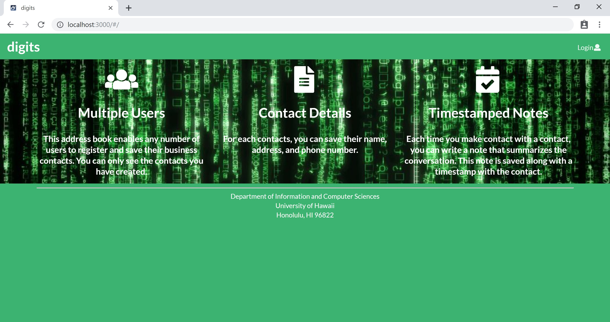
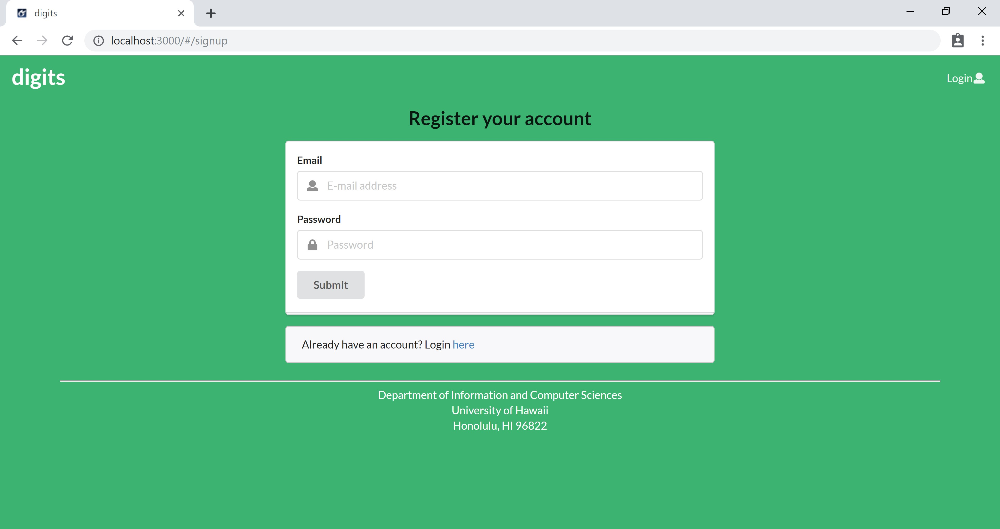
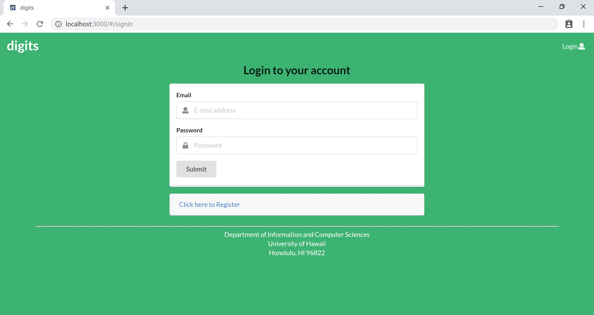
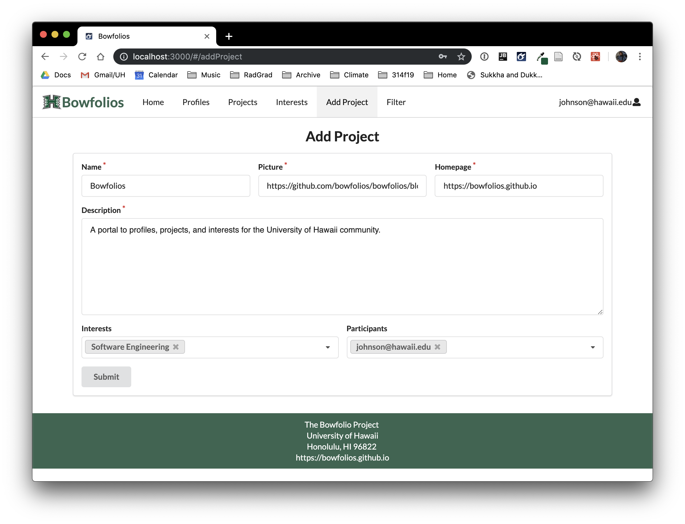
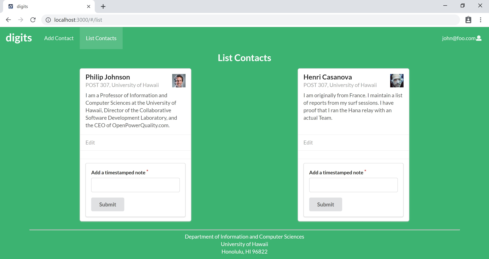

## Contributors
* [Jay Ryan Jamorabon](https://jayryanj.github.io/)
* [Nadine Alcantara](https://nadine-alcantara.github.io/)
* [Nathan Zenger](https://nzenger.github.io/)
* [Jeff Wong](https://jeff-yc-wong.github.io/)

## Table of contents

* [Goals](#goals)
* [Overview](#overview)
* [Mockup Pages](#mockup-pages)

## Goals 

textXchange enables students to login to the site and indicate books they would like to buy and books they would like to sell. They must supply the ISBN number (i.e. the unique ID) for each book, enabling the system to match up buyers and sellers. Buyers and sellers can rate each other, enabling users to build up confidence in each other over time. Admins can ban users for inappropriate behavior.. It is implemnted using various technologies including:

* [Meteor](https://www.meteor.com/) for Javascript-based implementation of client and server code. 
* [React](https://reactjs.org/) for component-based UI implementation and routing.
* [Semantic UI React](https://react.semantic-ui.com/) CSS Framework for UI design.
* [Uniforms](https://uniforms.tools/) for React and Semantic UI-based form design and display.

## Overview

textXchange show be able to provide users in the UH Community with an easy and simple experience when selling or purchasing books. Some concepts that we wish to implement includes:

* A map for users to indicate where they would like to meet for the exchange
* A rating system to allow users to rate their experience regarding selling or buying
* Different types of payment systems (Ex. Venmo, PayPal, cash etc.)
* An admin are able to ban users/scammers for inappropriate behaviors
* Users are able to search for the books they need
* Users are are to sort books based on classes that the book is needed in
* Look up png file of book cover using ISBN number
* Using amazon api, find original price of the book that is being sold

## Mockup Pages

Here are template for what our page would look like:

### Landing Page

When you retrieve the app at http://localhost:3000, this is what should be displayed:

The landing page will provide brief descriptions of what a user can do on textXchange, such as search for books, pay for books, and display an exchange map

### Sign Up Page

Clicking on the Login link, then on the Sign Up, this page is displayed:

### Sign In Page

Clicking on the Login link, then on the Sign In, this page is displayed:

### Add Book Page

After loging in, the user may select the Add Book page that would allow the user to add a book. The form would include a variety of input fields, such text fields to specify names and description, and tags to specify the course or major this book qualifies for.

### List Book Page

Clicking on the List Books link brings up a page that lists all of the book associated with the logged in user:

