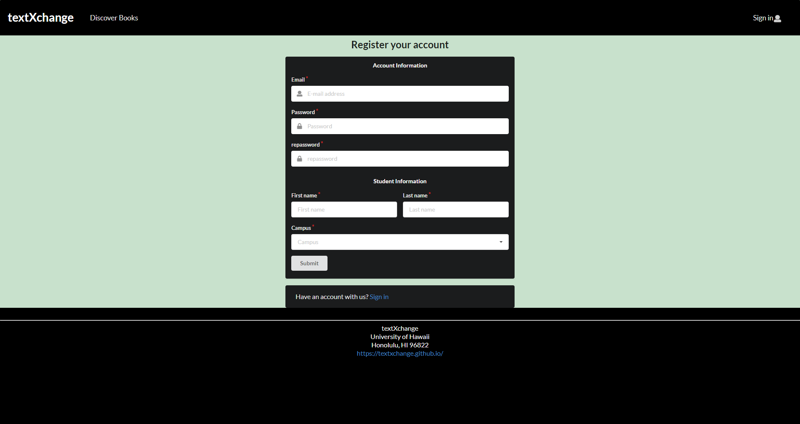
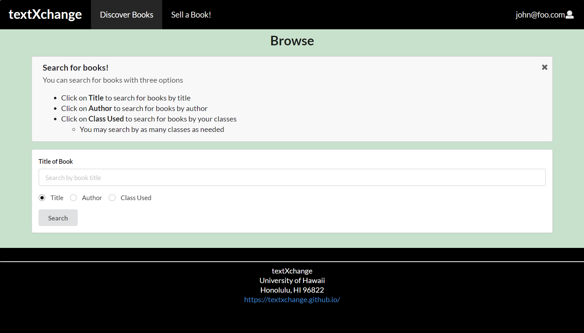

## Contributors
* [Jay Ryan Jamorabon](https://jayryanj.github.io/)
* [Nadine Alcantara](https://nadine-alcantara.github.io/)
* [Nathan Zenger](https://nzenger.github.io/)
* [Jeff Wong](https://jeff-yc-wong.github.io/)

## Table of contents

* [Goals](#goals)
* [Overview](#overview)
* [Project Pages](#project-pages)
* [Project Board](#project-board)

## Project Board
* [Milestone 1](https://github.com/textxchange/textXchange/projects/1)
* [Milestone 2](https://github.com/textxchange/textXchange/projects/2)

## Goals 

textXchange enables students to login to the site and indicate books they would like to buy and books they would like to sell. They must supply the ISBN number (i.e. the unique ID) for each book, enabling the system to match up buyers and sellers. Buyers and sellers can rate each other, enabling users to build up confidence in each other over time. Admins can ban users for inappropriate behavior.. It is implemnted using various technologies including:

* [Meteor](https://www.meteor.com/) for Javascript-based implementation of client and server code. 
* [React](https://reactjs.org/) for component-based UI implementation and routing.
* [Semantic UI React](https://react.semantic-ui.com/) CSS Framework for UI design.
* [Uniforms](https://uniforms.tools/) for React and Semantic UI-based form design and display.

## Overview

textXchange show be able to provide users in the UH Community with an easy and simple experience when selling or purchasing books. Some concepts that we wish to implement includes:

* A map for users to indicate where they would like to meet for the exchange
* A rating system to allow users to rate their experience regarding selling or buying
* Different types of payment systems (Ex. Venmo, PayPal, cash etc.)
* An admin are able to ban users/scammers for inappropriate behaviors
* Users are able to search for the books they need
* Users are are to sort books based on classes that the book is needed in
* Look up png file of book cover using ISBN number
* Using amazon api, find original price of the book that is being sold

## Project Pages

Here are our current mockup pages for our deployed app.

### Landing Page

The landing page will provide brief descriptions of what a user can do on textXchange, such as search for books, pay for books, and display an exchange map.

Page link: [Click here](http://textxchange.meteorapp.com/#/)

### Sign In Page

Clicking on the Sign In link on the navigation bar, this page is displayed:

Page link: [Click here](http://textxchange.meteorapp.com/#/signin)

### Sign Up Page

If the user does not have an existing account, they may click on the "Register" link to create an account. This page is displayed:

The user must be a University of Hawaii student, as the input fields are the user's student ID number and campus.

Page link: [Click here](http://textxchange.meteorapp.com/#/signup)

### Landing after login

After loging in, the navigation bar on the landing page now shows options to sell a book and discover other books on the database

Page link: [Click here](http://textxchange.meteorapp.com/#/)

### Add Book Page

After loging in, the user may select the Add Book page that would allow the user to add a book. The form would include a variety of input fields, such text fields to specify the book's title, author, year published, ISBN, description, cost, class used, and condition.

Page link: [Click here](http://textxchange.meteorapp.com/#/add)

### Browse Book Page

Clicking on the Browse Books link allows the logged in user to browse all the books listed on the site. Each book displays the book cover, title, author, description, price, and upload date. The logged in user may also filter which books they need with the search option (will be implemented in a future milestone). In addition, the book cover will be automatically uploaded by fetching the appropriate image from the internet based on the ISBN.

Page link: [Click here](http://textxchange.meteorapp.com/#/discover)
