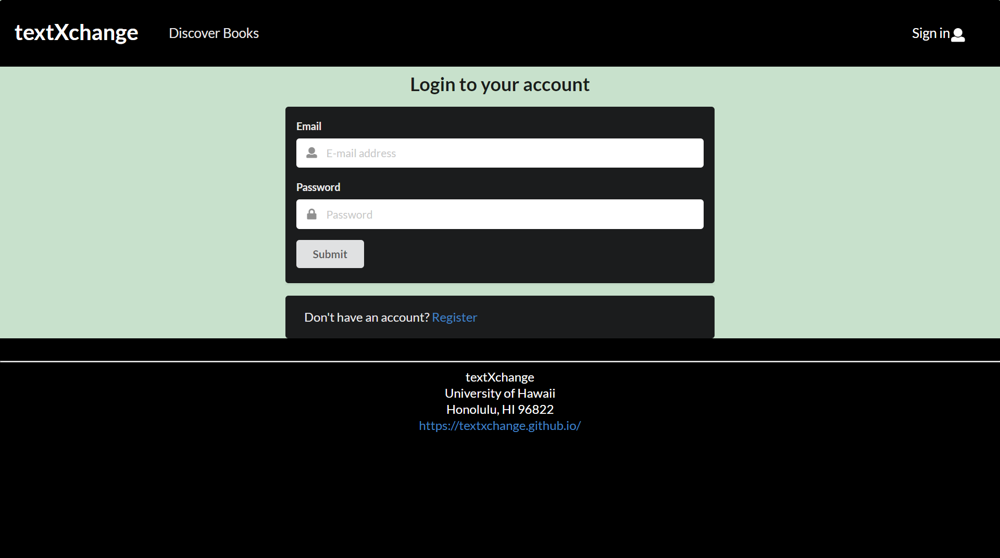
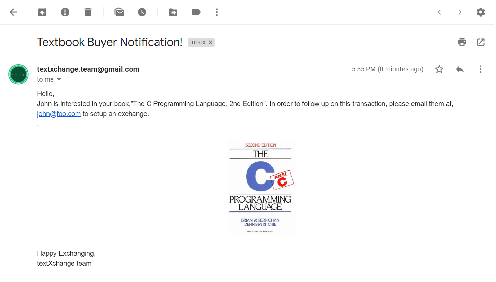

## Table of contents

* [Goals](#goals)
* [Overview](#overview)
* [User Guide](#user-guide)
* [Community Feedback](#community-feedback)
* [Developer Guide](#developer-guide)
* [Development History](#development-history)
* [Contributors](#contributors)

### Links
* [Deployed app on Galaxy](http://textxchange.meteorapp.com/#/)
* [GitHub Organization](https://github.com/textxchange)
* [M1](https://github.com/textxchange/textXchange/projects/1), 
[M2](https://github.com/textxchange/textXchange/projects/2), 
[M3](https://github.com/textxchange/textXchange/projects/4)


## Goals 

TextXchange enables students to login to the site and indicate books they would like to buy and books they would like to sell. They must supply the ISBN number (i.e. the unique ID) for each book, enabling the system to match up buyers and sellers. Buyers and sellers can rate each other, enabling users to build up confidence in each other over time. Admins can ban users for inappropriate behavior.. It is implemnted using various technologies including:

* [Meteor](https://www.meteor.com/) for Javascript-based implementation of client and server code. 
* [React](https://reactjs.org/) for component-based UI implementation and routing.
* [Semantic UI React](https://react.semantic-ui.com/) CSS Framework for UI design.
* [Uniforms](https://uniforms.tools/) for React and Semantic UI-based form design and display.

## Overview

TextXchange show be able to provide users in the UH Community with an easy and simple experience when selling or purchasing books. Some concepts that we wish to implement includes:

* A map for users to indicate where they would like to meet for the exchange
* A rating system to allow users to rate their experience regarding selling or buying
* An admin are able to ban users/scammers for inappropriate behaviors
* Users are able to search for books based on classes that the book is needed in
* Look up png file of book cover using ISBN number

## User Guide

Here is our currently deployed app.

### Landing Page


The landing page will provide brief descriptions of what a user can do on TextXchange, such as search for books, pay for books, and display an exchange map.

Page link: [Click here](http://textxchange.meteorapp.com/#/)

### Sign In Page

Clicking on the Sign In link on the navigation bar, this page is displayed:



Page link: [Click here](http://textxchange.meteorapp.com/#/signin)

### Sign Up Page

If the user does not have an existing account, they may click on the "Register" link to create an account. This page is displayed:


After signing up, the user will be givin an email notification, confirming that the account has been created on the app


Page link: [Click here](http://textxchange.meteorapp.com/#/signup)

### Profile Page

After signing in, the app will redirect the user to their profile page showing their information and the books that they are selling.


The user may also choose to edit their profile page with a new profile picture and updated description.


To edit a book, the user may click on the Edit button to make changes on its various components.


Page link: [Click here](http://textxchange.meteorapp.com/#/profile)

### Add Book Page

After loging in, the user may select the Add Book page that would allow the user to add a book. The form would include a variety of input fields, such text fields to specify the book's title, author, year published, ISBN, description, cost, class used, and condition.


Page link: [Click here](http://textxchange.meteorapp.com/#/add)

### Browse Book Page

Clicking on the Browse Books link allows the logged in user to browse all the books listed on the site. Each book displays the book cover, title, author, description, price, and upload date. The logged in user may also filter which books they need with the search option (will be implemented in a future milestone). In addition, the book cover will be automatically uploaded by fetching the appropriate image from the internet based on the ISBN.


Page link: [Click here](http://textxchange.meteorapp.com/#/discover)

### Buying a Book

When the user finds a book of their interest, they may click on the Buy Book button that will redirect them to the form to purchase it. 


It will display the book's details and a confirmation button to contact the seller via automatic email.



## Community Feedback

We have shown our app to several UH Manoa students for community feedback. We allowed them to sign up, set up a profile, browse for books, sell a book, purchase a book, and see how one can "purchase" their own listed book. From this, we have accumulated these responses:

* When writing the book description, it's unclear about what a user should write, whether it's the content description or user experience such as how helpful the book is for their class.
* Users can add a negative value for selling books by incrementing down on the down arrow

## Developer Guide

This section provides information of interest to Meteor developers wishing to use this code base as a basis for their own development tasks. 

### Installation

First, [install Meteor](https://www.meteor.com/install).

Second, visit the TextXchange application github page and click the "Use this template" button to create your own repository initialized with a copy of this application. Alternatively, you can download the sources as a zip file or make a fork of the repo.  However you do it, download a copy of the repo to your local computer.
  
Third, cd into the textXchange/app directory and install libraries with:

```
$ meteor npm install
```

Fourth, run the system with:

```
$ meteor npm run start
```

If all goes well, the application will appear at [http://localhost:3000](http://localhost:3000). 

### Application Design

TextXchange is based upon [meteor-application-template-react](https://ics-software-engineering.github.io/meteor-application-template-react/) and [meteor-example-form-react](https://ics-software-engineering.github.io/meteor-example-form-react/). Please use the videos and documentation at those sites to better acquaint yourself with the basic application design and form processing in TextXchange.

## Development History

The development process for TextXchange conformed to [Issue Driven Project Management](http://courses.ics.hawaii.edu/ics314f19/modules/project-management/) practices. In a nutshell:
 
* Development consists of a sequence of Milestones. 
* Each Milestone is specified as a set of tasks.  
* Each task is described using a GitHub Issue, and is assigned to a single developer to complete. 
* Tasks should typically consist of work that can be completed in 2-4 days.  
* The work for each task is accomplished with a git branch named "issue-XX", where XX is replaced by the issue number. 
* When a task is complete, its corresponding issue is closed and its corresponding git branch is merged into master. 
* The state (todo, in progress, complete) of each task for a milestone is managed using a GitHub Project Board.

The following sections document the development history of TextXchange.

### Milestone 1: Mockup development

The goal of [Milestone 1](https://github.com/textxchange/textXchange/projects/1) was to create a set of HTML pages providing a mockup of the pages in the system. 

### Milestone 2: Data model development 

The goal of [Milestone 2](https://github.com/textxchange/textXchange/projects/2) was to implement the data model: the underlying set of Mongo Collections and the operations upon them that would support the TextXchange application.

### Milestone 3: Final touches

The goal of [Milestone 3](https://github.com/textxchange/textXchange/projects/4) was to clean up the code base and fix minor UI issues.

## Contributors
* [Jay Ryan Jamorabon](https://jayryanj.github.io/)
* [Nadine Alcantara](https://nadine-alcantara.github.io/)
* [Nathan Zenger](https://nzenger.github.io/)
* [Jeff Wong](https://jeff-yc-wong.github.io/)

